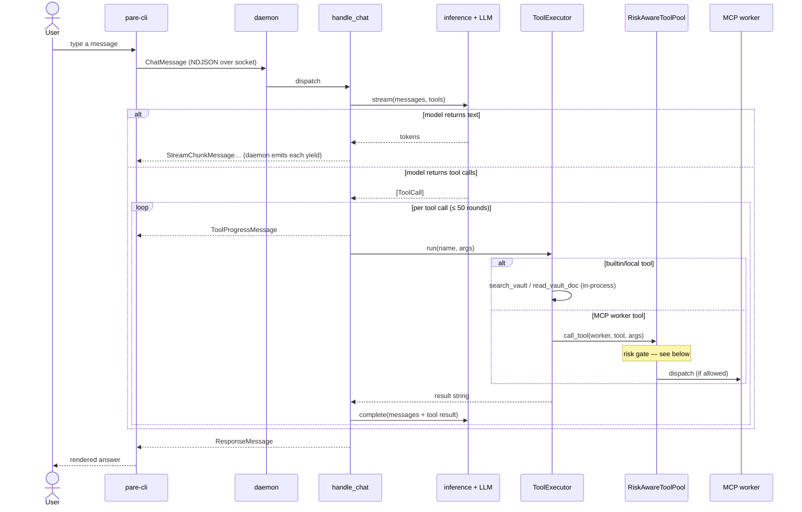
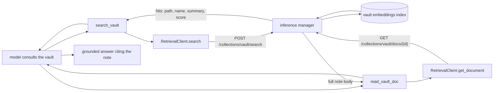
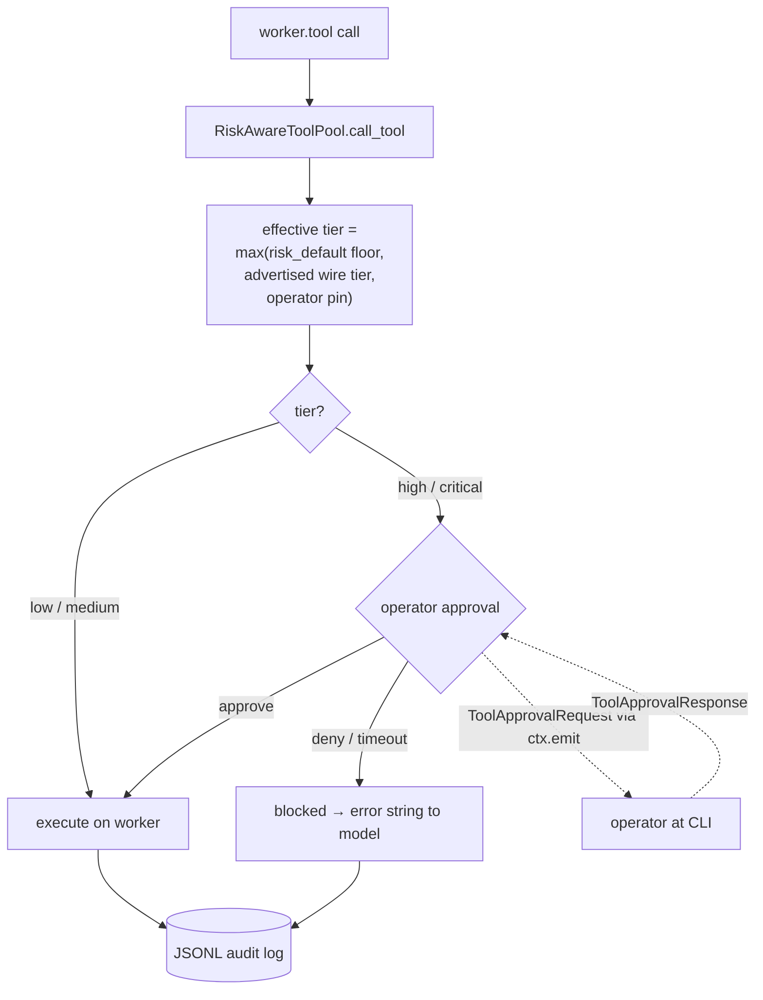
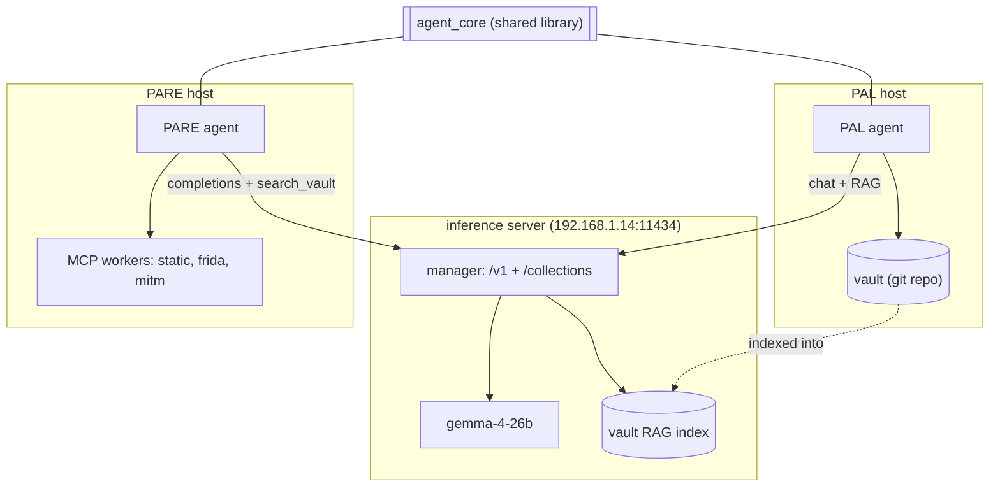

# PARE architecture

How the pieces fit and where the code lives. For what PARE *is*, see
[`README.md`](README.md); to get it running, [`QUICKSTART.md`](QUICKSTART.md);
for the risk model and worker registry, [`WORKERS.md`](WORKERS.md).


PARE is a **daemon + thin client**: `python -m pare` runs the long-lived agent
that binds a Unix socket; `pare-cli` is a REPL that connects to it. The agent is
a thin subclass of [`agent_core`](https://github.com/EdibleTuber/agent_core)'s
`Agent` — most machinery (inference, conversation, tool execution, risk gating,
worker discovery) lives in the shared library.

### A chat turn

A message streams through `handle_chat`, which loops between the model and tools
until the model returns a final answer. Everything `handle_chat` yields is
emitted to the client by the daemon; risk gating and operator approval happen
transparently inside tool dispatch.



### Reading PAL's research vault (RAG)

PARE consumes PAL's knowledge over the inference server's retrieval API — no
shared filesystem required. `search_vault` finds notes by meaning; `read_vault_doc`
pulls a hit's full body.



### Risk gating & operator approval (HITL)

Every **MCP worker** tool call flows through `RiskAwareToolPool`, which resolves
an effective tier and gates high/critical calls on operator approval, auditing
every dispatch. (Builtin/local tools like `search_vault` run in-process and are
not gated.)



### Ecosystem

PARE is the second agent on `agent_core` (after PAL). PAL curates the vault;
the inference server indexes it for RAG; PARE reads it and drives RE workers.



## Layout

```
pare/
    agent.py            PareAgent — handle_chat / handle_command / setup / system_prompt
    __main__.py         python -m pare entry point (calls run_daemon)
    cli.py              pare-cli — wires agent_core's REPL to PARE's socket
    config.py           PAREConfig (PARE_* env vars)
    arcticbase.py       ArcticBase client — workbenches, reports, descriptors
    capture_store.py    per-project capture store (.pare/ walk-up)
    project_slug.py     one slug for workbench, captures and artifacts
    heartbeat.py        liveness the bench status page reads
    handback.py         operator-handback checkpoints
    repeat_guard.py     no-progress floor on repeated tool calls
    prompts/system.md   the RE loop as the model runs it
    commands/           /health /worker /mitm /snapshot /frida … (one module each)
    tools/              publish_finding, read_vault_doc, static_analyze, _http
workers.yaml            MCP worker registry and the trust anchor — see WORKERS.md
bench/                  the Pi at the bench: status server, kiosk + status units
deploy/                 the units and compose overrides that are actually deployed
scripts/                bench deploy/doctor, live worker + command smokes
tests/
docs/
    superpowers/        designs, plans and build records
    *-quickstart.md     frida and mitm walkthroughs
```

This is a **map, not an inventory** — `git ls-files` is the inventory, and a tree
transcribed into prose goes stale the first time a module is added. What it is
for is showing which part owns which concern.

MCP-discovered tools are registered at startup by `PareAgent.register_tools()` and dispatched through a `RiskAwareToolPool`, so every worker tool call is risk-evaluated and audited.

