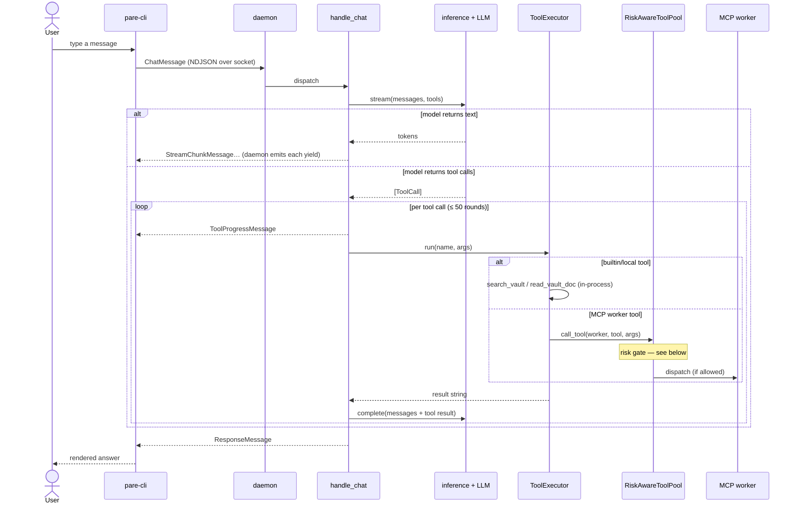
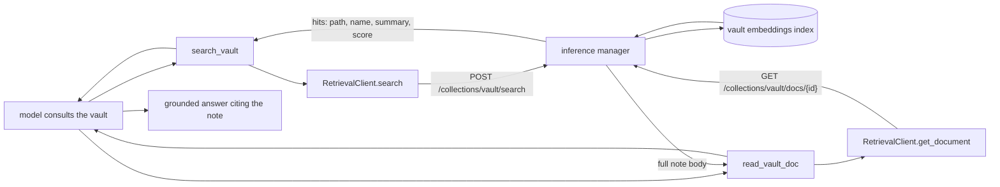
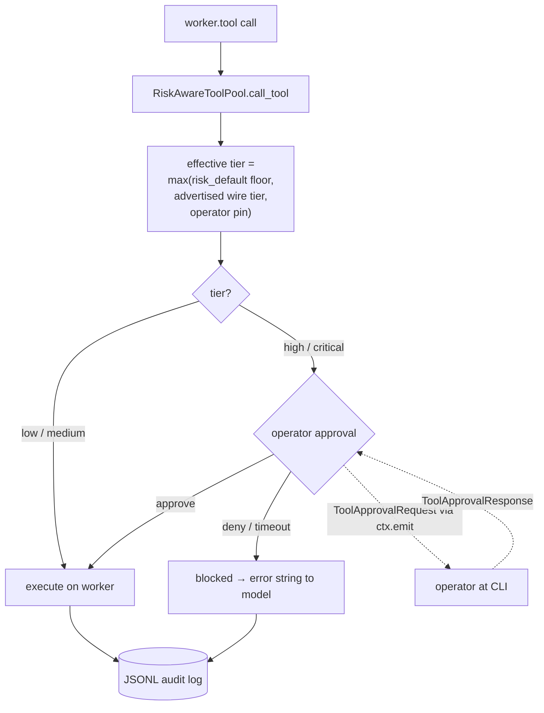
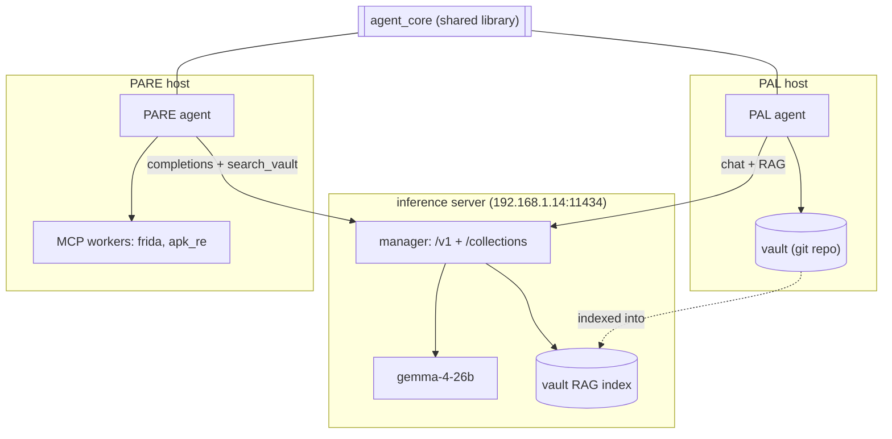

---

# pare

Personal Agentic Reverse Engineer — a conversational mobile-RE operator.

PARE holds a tool-using conversation about reverse-engineering work: it reasons
over a chat, **consults PAL's research vault** by semantic search (so it answers
from curated knowledge, not just training data), and **drives RE worker tools**
(static APK analysis, Frida) through a risk-gated dispatch layer that pauses
high-risk actions for operator approval and audits every call. Built on
[`agent_core`](https://github.com/EdibleTuber/agent_core).

## Design & Plans

- Design spec: [`docs/superpowers/specs/2026-05-12-pare-v1-design.md`](docs/superpowers/specs/2026-05-12-pare-v1-design.md)
- Phase 0 (agent_core extraction): [`docs/superpowers/plans/2026-05-13-phase0-agent-core-extraction.md`](docs/superpowers/plans/2026-05-13-phase0-agent-core-extraction.md) — landed in `agent_core@v1.2.0`
- Phase 1 (this scaffold + apk_re_agents wrapper): [`docs/superpowers/plans/2026-05-14-phase1-pare-scaffold-and-static-wrapper.md`](docs/superpowers/plans/2026-05-14-phase1-pare-scaffold-and-static-wrapper.md)
- Phase 2 (agent_core MCP execution layer): [`docs/superpowers/plans/2026-05-16-phase2-agent-core-mcp-client.md`](docs/superpowers/plans/2026-05-16-phase2-agent-core-mcp-client.md) — landed in `agent_core@v1.3.0`
- Phase 3 (apk_re_agents Streamable HTTP migration + PARE MCP-direct workers): [`docs/superpowers/plans/2026-05-17-phase3-apk-re-agents-streamable-http-and-pare-wiring.md`](docs/superpowers/plans/2026-05-17-phase3-apk-re-agents-streamable-http-and-pare-wiring.md) — landed apk_re_agents v0.2.0 + PARE workers.yaml
- Risk enforcement (`agent_core@v1.5.0`/`v1.5.1`): [`docs/superpowers/plans/2026-05-27-risk-enforcement-mcp-dispatch.md`](docs/superpowers/plans/2026-05-27-risk-enforcement-mcp-dispatch.md) — `RiskAwareToolPool`: dispatch-time risk gating + HITL approval prompt + audit log
- Risk tier on the wire (`agent_core@v1.6.0`): per-tool risk tiers advertised over MCP `_meta`; effective tier = `max(floor, wire, operator-pin)`
- Phase 4 (landed): in-house Python Frida MCP server (`pare-frida-mcp`, stdio worker) registered + risk-gated; smoke-tested end-to-end
- Conversational loop: [`docs/superpowers/specs/2026-05-30-pare-handle-chat-design.md`](docs/superpowers/specs/2026-05-30-pare-handle-chat-design.md) — `handle_chat`/`handle_command`, vault reads via `search_vault` + `read_vault_doc`

## Install

```bash
python -m venv .venv
.venv/bin/pip install --upgrade pip
.venv/bin/pip install -e ".[dev]"
```

Requires Python 3.12+. `agent_core` is pulled from GitHub at install time.

## Configure

Copy `.env.example` to `.env` and fill in the values:

```bash
cp .env.example .env
$EDITOR .env
```

Key variables:
- `PARE_INFERENCE_URL` — inference manager base URL; serves both `/v1/chat/completions` and `/collections/{id}/search` (default: `http://192.168.1.14:11434`)
- `PARE_MODEL` — model name (default: `gemma-4-26b-a4b-it-q4_k_m`, which emits **structured** tool calls; some models, e.g. Qwen variants, emit tool calls as unparsed template text and won't drive tools reliably)
- `PARE_VAULT_PATH` — PARE's own state dir (profile/wisdom/channels). PAL's research is read over RAG, not this path.
- `PARE_COLLECTION_ID` — retrieval collection PARE searches (default `vault`); must match the collection the inference server indexes PAL's vault into
- `PARE_AUDIT_DIR` — where the risk-gating audit log is written (default: `~/.local/share/pare/audit`, outside the vault)

See `.env.example` for the full list.

## Run

Start the daemon **with the venv activated** (or with `.venv/bin` on `PATH`):

```bash
source .venv/bin/activate
python -m pare          # or: pare-daemon
```

> **Why activate?** stdio workers (e.g. `frida`) are launched by bare command
> name (`command: pare-frida-mcp` in `workers.yaml`). If you run
> `.venv/bin/python -m pare` *without* activating, the daemon can't find
> `pare-frida-mcp` on `PATH` and logs `worker frida discovery failed (No such
> file or directory)` — the agent still starts, but with no Frida tools.

Connect via the CLI (separate terminal):

```bash
.venv/bin/pare-cli
```

(`pare-cli` wires `agent_core`'s generic REPL to PARE's config/socket. The bare
`python -m agent_core.adapters.cli` does **not** work — that module is a library
with no `__main__`.)

## Smoke Test

```bash
.venv/bin/pytest tests/ -v
```

The full suite passes (currently 44 passed, 3 skipped). The 3 skips are env-gated phase 1 / phase 3 smokes that need a running worker stack (set `PARE_PHASE1_SMOKE` / `PARE_PHASE3_SMOKE` to enable them). For an end-to-end check against the live stack, see [`QUICKSTART.md`](QUICKSTART.md).

## Workers & risk gating

PARE reaches analysis tools through MCP workers declared in `workers.yaml`. Each entry maps to an `agent_core` `WorkerSpec`:

- **Transport** — `streamable_http` (a worker reached over HTTP, e.g. the apk_re_agents agents) or `stdio` (a worker PARE launches as a subprocess and talks to over stdin/stdout, e.g. the in-house `pare-frida-mcp` Frida server).

> For the end-to-end Frida dynamic-analysis workflow (device + `frida-server`
> setup, attach, Java hooks, scripts, capture store), see
> [`docs/frida-quickstart.md`](docs/frida-quickstart.md).
- **`risk_default`** — the tier applied to every tool the worker exposes. `low`/`medium` auto-execute (still audited); `high` requires operator approval before dispatch; `critical` requires approval **and** a justification.

At dispatch, calls flow through a `RiskAwareToolPool`. For `high`/`critical` tools you get an inline prompt in the CLI:

```
--- approval required ---
  frida.execute_script  (declared=critical effective=critical)
  args: source=Interceptor.attach(...
  approve? [y/n/j/a]:
```

`y` approves once, `n` denies, `j` approves with a justification (forced for `critical`), `a` approves every call to that tool for the rest of the session. Every dispatch — approved, denied, or auto — is appended to a JSONL audit log under `PARE_AUDIT_DIR` (default `~/.local/share/pare/audit`), which lives outside your vault.

### Adding a worker

Edit `workers.yaml` and restart the daemon. Streamable HTTP worker:

```yaml
workers:
  my_http_worker:
    endpoint: http://127.0.0.1:9100/mcp
    transport: streamable_http
    risk_default: low
    capability_tags: [static, apk]
```

stdio worker (PARE launches the process). The in-house Frida server ships as the
`pare-frida-mcp` console script, so the daemon must run with `.venv/bin` on
`PATH` (see [Run](#run)):

```yaml
workers:
  frida:
    command: pare-frida-mcp
    transport: stdio
    risk_default: high          # FLOOR; per-tool wire tiers + operator pins can escalate
    capability_tags: [mobile, dynamic, android, frida]
```

Operator pins in `workers.yaml` can force a tool's tier up regardless of what the
worker advertises (e.g. `frida_execute_script → critical`,
`frida_write_memory → high`).

## Discord (optional)

Discord is not wired by default. To opt in:

1. Add `agent_core[discord]` to `dependencies` in `pyproject.toml`.
2. In `pare/__main__.py`, instantiate the gateway and pass it to
   `run_daemon` (see `agent_core.adapters.discord_gateway` for the API).

## Systemd Setup

Two service files are included in `systemd/`. Edit the `WorkingDirectory` and
`EnvironmentFile` paths to match your deployment, then:

```bash
cp systemd/pare-daemon.service ~/.config/systemd/user/
systemctl --user daemon-reload
systemctl --user enable --now pare-daemon
```

The CLI (`pare-cli`) is typically run interactively in a terminal, not as a
service.

---

## Architecture & data flow

PARE is a **daemon + thin client**: `python -m pare` runs the long-lived agent
that binds a Unix socket; `pare-cli` is a REPL that connects to it. The agent is
a thin subclass of [`agent_core`](https://github.com/EdibleTuber/agent_core)'s
`Agent` — most machinery (inference, conversation, tool execution, risk gating,
worker discovery) lives in the shared library.

### A chat turn

A message streams through `handle_chat`, which loops between the model and tools
until the model returns a final answer. Everything `handle_chat` yields is
emitted to the client by the daemon; risk gating and operator approval happen
transparently inside tool dispatch.



### Reading PAL's research vault (RAG)

PARE consumes PAL's knowledge over the inference server's retrieval API — no
shared filesystem required. `search_vault` finds notes by meaning; `read_vault_doc`
pulls a hit's full body.



### Risk gating & operator approval (HITL)

Every **MCP worker** tool call flows through `RiskAwareToolPool`, which resolves
an effective tier and gates high/critical calls on operator approval, auditing
every dispatch. (Builtin/local tools like `search_vault` run in-process and are
not gated.)



### Ecosystem

PARE is the second agent on `agent_core` (after PAL). PAL curates the vault;
the inference server indexes it for RAG; PARE reads it and drives RE workers.



## Layout

```
pare/
    agent.py            PareAgent — handle_chat / handle_command / setup / system_prompt
    __main__.py         python -m pare entry point (calls run_daemon)
    cli.py              pare-cli — wires agent_core's REPL to PARE's socket
    config.py           PAREConfig (PARE_* env vars; model defaults to gemma-4-26b)
    prompts/
        system.md       system prompt — PARE identity + vault-usage guidance
    commands/
        hello.py         example Command
        health.py        /health — daemon status + endpoints
    tools/
        static_analyze.py  apk_re_agents /jobs wrapper
        read_vault_doc.py  fetch a full vault note over RAG (pairs with the search_vault builtin)
workers.yaml            MCP worker registry — stdio (frida) + streamable_http (apk_re); see "Workers & risk gating"
```

MCP-discovered tools are registered at startup by `PareAgent.register_tools()` and dispatched through a `RiskAwareToolPool`, so every worker tool call is risk-evaluated and audited.

### Extension points

| Point | How to use |
|---|---|
| `PareAgent.commands` | Add `Command` subclasses; `/help` is automatic |
| `PareAgent.tools` | Add `Tool` subclasses; executor picks them up |
| `PareAgent.disabled_builtins` | Remove built-in commands/tools by name |
| `PareAgent.setup()` | Construct domain resources after framework managers are ready |
| `PareAgent.system_prompt(ctx)` | Build the per-turn system prompt |
| `PareAgent.decide_mode(conversation)` | Override reasoning-mode logic |

Full API docs: [agent_core](https://github.com/EdibleTuber/agent_core)
