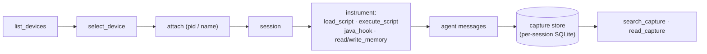

# PARE + Frida Quick Start

Drive **Frida dynamic instrumentation** (Android) through PARE: discover devices,
attach to a process, hook Java methods, run scripts, inspect memory, and query a
capture store — all conversationally, with every dangerous action gated on your
approval and audited.

This builds on the base [`QUICKSTART.md`](../QUICKSTART.md) (inference server,
vault, daemon, CLI). Read that first; this guide adds the Frida worker.

## What the Frida worker provides

PARE talks to Frida through the in-house [`pare-frida-mcp`](https://github.com/EdibleTuber/pare-frida-mcp)
stdio worker (Android v1, Frida 17). It exposes 18 tools; PARE registers them as
`frida_<tool>`:

| Tool | Wire tier | What it does |
|---|---|---|
| `list_devices` | low | List Frida devices |
| `select_device` | low | Select a device by id |
| `attach` | medium | Attach to a process by pid or name |
| `list_sessions` | low | List live sessions with a real liveness probe |
| `detach` | medium | Detach a live session and tear down its capture state |
| `enumerate_processes` | low | List device processes into the `@snapshots` store |
| `enumerate_applications` | low | List installed apps into the `@snapshots` store |
| `enumerate_modules` | low | List an attached process's modules into `@snapshots` |
| `enumerate_exports` | low | List a module's exports into `@snapshots` |
| `load_script` | medium | Load a bundled script export set |
| `execute_script` | **critical** | Evaluate arbitrary JS in a session |
| `java_hook` | **high** | Install an observing Java method hook |
| `java_hook_remove` | low | Remove a Java method hook |
| `read_memory` | **high** | Read target memory (hex preview) |
| `write_memory` | **high** | Write bytes to target memory |
| `search_capture` | low | Search captured events / snapshots |
| `read_capture` | low | Read a captured record slice |
| `page_capture` | low | Read ALL rows of a snapshot for `/snapshot` (complete, not sampled) |

> **iOS, SSL/root/JB bypasses, the script vault, and `scan_memory` are not in v1** —
> they're tracked fast-follows in the worker's design spec.

## 1. Prerequisites

Beyond the base quickstart:

- **The `pare-frida-mcp` worker installed** in PARE's venv. It ships as a PARE
  dependency, so `pip install -e ".[dev]"` already pulled it; confirm:
  ```bash
  .venv/bin/pare-frida-mcp --help    # should print, not "command not found"
  ```
- **A rooted Android target** — a physical device or an emulator (e.g. a rooted
  AVD or Genymotion).
- **`frida-server` running on the target, matching the host's Frida version.**
  Check the host version, push the matching server, and start it:
  ```bash
  .venv/bin/python -c "import frida; print(frida.__version__)"   # e.g. 17.9.11
  # download frida-server-<that version>-android-<arch> from the Frida releases,
  adb push frida-server-17.9.11-android-arm64 /data/local/tmp/frida-server
  adb shell "chmod 755 /data/local/tmp/frida-server"
  adb shell "su -c '/data/local/tmp/frida-server &'"
  ```
- **`adb` connectivity** (`adb devices` lists your target). USB-attached devices
  appear to Frida as `usb`; an emulator typically as `local` or `usb`.

Sanity-check Frida sees the device *before* involving PARE:

```bash
.venv/bin/frida-ls-devices      # should list your device
.venv/bin/frida-ps -U | head    # processes on the USB device
```

If these fail, fix the device/`frida-server` layer first — PARE can't paper over it.

## 2. Register the worker

PARE ships with the `frida` worker already declared in `workers.yaml`:

```yaml
workers:
  frida:
    command: pare-frida-mcp
    transport: stdio
    risk_default: high          # FLOOR during rollout — every Frida tool prompts
    capability_tags: [mobile, dynamic, android, frida]

risk_overrides:
  - ["frida_execute_script", "critical"]   # arbitrary JS — approval + justification
  - ["frida_write_memory", "high"]          # mutates target memory
```

The effective tier of each call is `max(risk_default floor, wire tier, operator pin)`.
Because the floor is **high**, *every* Frida tool prompts for approval during this
conservative rollout — not just the dangerous ones. (See the risk-gating diagram in
the [README](../README.md#risk-gating--operator-approval-hitl).)

## 3. Launch

> **Activate the venv** so the daemon can spawn `pare-frida-mcp` by name. Without
> it you'll see `worker frida discovery failed (No such file or directory)` and
> get no Frida tools.

```bash
source .venv/bin/activate
python -m pare      # daemon
```

Confirm the worker registered (the daemon discovers its tools at startup). In the
CLI (`pare-cli` in another activated shell), ask:

```
> What Frida tools do you have?
```

PARE should list the `frida_*` tools. If it doesn't, see Troubleshooting.

## 4. The session lifecycle

A Frida session flows device → process → instrumentation → capture:



Hooks and scripts emit messages that land in a per-session SQLite **capture store**;
you retrieve them with `search_capture` / `read_capture`. (v1 detail: the message
pump flushes to disk when you read captures, not on a timer — so read captures to
force a flush. Very chatty hooks can drop messages between flushes, with a counter.)

## 5. A guided session

Each Frida tool call pauses for approval. At the prompt: `y` once · `n` deny ·
`j` approve with justification (required for `critical`) · `a` approve this tool
for the rest of the session (works for `high`, **not** for `critical` — arbitrary
JS always re-prompts).

```
> List the Frida devices and attach to com.example.targetapp.

--- approval required ---
  frida.list_devices  (declared=high effective=high)
  approve? [y/n/j/a]: y
  → [{"id":"usb","name":"Pixel 6","type":"usb"}, ...]

--- approval required ---
  frida.attach  (declared=high effective=high)
  args: name=com.example.targetapp
  approve? [y/n/j/a]: y
  → session_id=sess-1

Attached. Session sess-1 is live on com.example.targetapp.

> Hook android.app.Activity.onResume and tell me when it fires.

--- approval required ---
  frida.java_hook  (declared=high effective=high)
  args: session_id=sess-1, class=android.app.Activity, method=onResume
  approve? [y/n/j/a]: a        # approve java_hook for the rest of this session

Hook installed. Navigate the app, then ask me to read the captures.

> Read the captured onResume events.
  → search_capture / read_capture (low → but floor is high, so: approve)
  → 3 events captured: onResume @ 12:01:03 (MainActivity), ...
```

For arbitrary instrumentation, `execute_script` is **critical** — PARE will require
a justification before running JS in the target:

```
> Run a quick script to dump the app's loaded class loaders.

--- approval required ---
  frida.execute_script  (declared=critical effective=critical)
  args: session_id=sess-1, source=Java.perform(() => { ... })
  approve? [y/n/j/a]: j
  justification> investigating classloader hierarchy for hook targeting
```

Every call — approved, denied, or auto — is appended to the JSONL audit log under
`PARE_AUDIT_DIR` (default `~/.local/share/pare/audit/`).

## Troubleshooting

| Symptom | Cause / fix |
|---|---|
| `worker frida discovery failed (No such file or directory: 'pare-frida-mcp')` | Daemon started without the venv on `PATH`. Activate the venv, restart. |
| PARE says it has no Frida tools | Worker didn't register — check the daemon log for the discovery line; confirm `pare-frida-mcp --help` runs in the venv. |
| `frida_list_devices` returns nothing / errors about the server | `frida-server` isn't running on the target or its version ≠ the host's `frida.__version__`. Re-push the matching server. |
| `attach` fails with "process not found" | Use the exact package/process name (`frida-ps -U`), or launch the app first. |
| Captures look empty right after a hook fires | The pump flushes on capture-read; call `read_capture`/`search_capture` to force a flush. Extremely chatty hooks can drop messages between flushes (a counter reports drops). |
| Every trivial call prompts for approval | Expected during rollout: the `frida` `risk_default` floor is `high`. Lower it (never below `medium`) only after you've validated the wire tiers + pins. |
